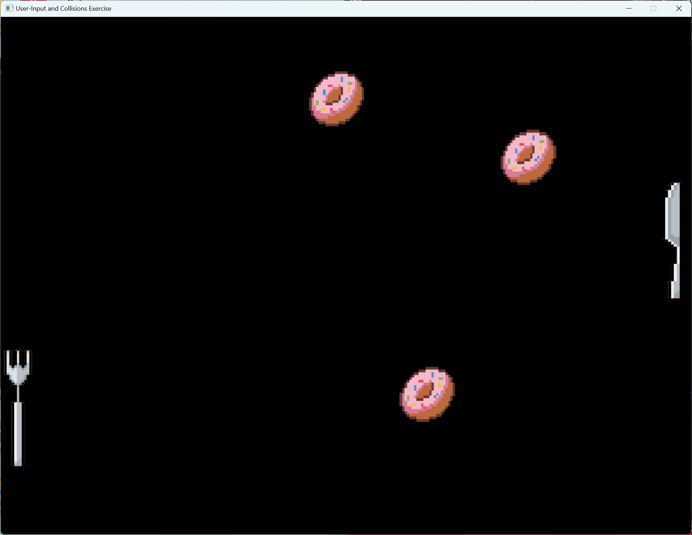

# 🍩 **Pong Clone - Fork vs. Knife Edition** 🏓

## **📌 About the Game**
This is a **Pong Clone** with a unique twist! Instead of classic paddles, you'll be playing with **a fork and a knife** as the paddles and **a bouncing donut** as the ball. The game supports **both single-player and two-player modes**, with customizable gameplay options.

## **🎮 Game Concept**
- The **left paddle** is represented by a **fork** 🏓🍴.
- The **right paddle** is represented by a **knife** 🏓🔪.
- The ball is a **delicious bouncing donut** 🍩.
- Players compete to **keep the donut in play** and score points!

## **⚙️ Game Rules**
1. The donut bounces off the **top and bottom walls**.
2. If the donut **passes a paddle**, the opponent wins.
3. The **game ends** when a donut crosses the left or right boundary.
4. **You can control how many donuts (1-3) appear on the screen!** 🎲

## **🕹️ How to Play**
### **▶️ Two-Player Mode**
- **Left Paddle (Fork) - Player 1:**  
  - Move **Up:** `W`  
  - Move **Down:** `S`  
- **Right Paddle (Knife) - Player 2:**  
  - Move **Up:** `↑` (Up Arrow)  
  - Move **Down:** `↓` (Down Arrow)

### **▶️ Single-Player Mode**
- **Press `T`** to switch to **Single-Player Mode**.
- In this mode, **the left paddle (fork) moves automatically**.
- The **right paddle (knife) is controlled using the arrow keys**.

### **▶️ Adjust Number of Donuts**
- **Press `1`** → Play with **1 donut**  
- **Press `2`** → Play with **2 donuts**  
- **Press `3`** → Play with **3 donuts**  

## **🏆 Winning the Game**
- If the donut passes **the left paddle (fork),** the **knife wins!** (`🔪 Knife Wins!`)
- If the donut passes **the right paddle (knife),** the **fork wins!** (`🍴 Fork Wins!`)
